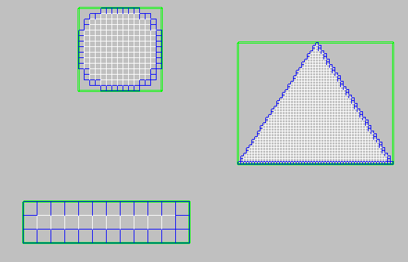
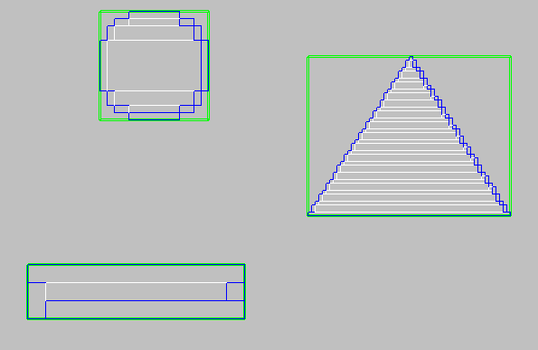
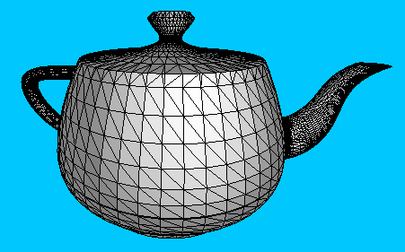
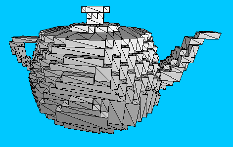

# simsAndGames
This repository is a compilation of my most recent Physics simulations and game clones using olc::PixelGameEngine.

## Getting them on your computer
Clone the repo
```
git clone https://github.com/owenbharrison/simsAndGames.git
```
Enter the directory
```
cd simsAndGames
```
Open the solution with Visual Studio
```
simsAndGames.sln
```

### Running the projects
In Visual Studio, `right click` the solution and select `Properties`.
Under `Configure Startup Projects`, select `Current selection`.
Press `OK`.
Select your desired project, and press the `Start Without Debugging` or `Ctrl+F5` to run!

## Gallery

### Pixels
A **pixelset** is an orientable 2d bitmap. This demo shows their adding, removing, slicing, moving, and springing actions.
It also shows usage of debug views such as bounding boxes, local grids, mass & inertia, wireframes, & outlines.


- The slicing uses Cohen-Sutherland segment clipping, Bresenham's line algorithm to draw air, & then floodfill/parts detection algorithm to seperate pieces.
- The collision uses edge detection to make a list of the edge "pixels" to check against other pixelsets.
- The raycast uses a DDA algorithm to minimize the number of steps before a ray intersection.
- The import/export commands use a custom format similar to that of OBJ files.
- The rendering uses a greedymeshing algorithm to minimize rectangle and segment draw calls.





### Voxels
For now, this project is more of an engine that I'd like to use for 3d simulations.
It is based on [javidx9](https://github.com/onelonecoder)'s [3D Graphics Engine](https://www.youtube.com/watch?v=ih20l3pJoeU) series.
This demo shows the movement, render, import, and outline features. The render camera is shown like blender cameras in the viewport.


A **voxelset** is an orientable 3d bitmap. The code contains conversions between the two.  
- Voxelizing turns a mesh into a voxelset using a polyhedra raycasting algorithm to determine if each voxel is contained in the mesh.
- Shelling turns a voxelset into a mesh using 6-axis greedymeshing to show where solid voxels turn into air.





## Future Works
- [ ] realistic spiders w/ inverse kinematics
- [ ] neuroevolution of augmenting topologies
- [ ] spelling bee w/ networking
- [ ] emscripten to host projects
- [ ] terraria water physics
- [ ] minecraft clone
- [x] raycasting
- [ ] sentiment analysis
- [ ] fourier transform
- [ ] levenshtein distance
- [ ] path creator
- [ ] open world navigation
- [ ] snipperclips clone
- [ ] procedural terrain generation
